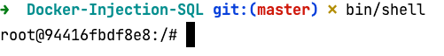

# Docker Injection SQL

Container Docker pour suivre le cours Injection SQL

# Lancement

Clonez le dépôt

```bash
git clone 
```

Lancez le container

```bash
bin/start
```

Accédez au shell du container MySQL

```bash
bin/shell
```



Lancement du client mysql (saisissez le mot de passe **root**)

```bash
root@94416fbdf8e8:/# mysql -u root -p
Enter password: 
Welcome to the MariaDB monitor.  Commands end with ; or \g.
Your MariaDB connection id is 7
Server version: 10.7.3-MariaDB-1:10.7.3+maria~focal mariadb.org binary distribution

Copyright (c) 2000, 2018, Oracle, MariaDB Corporation Ab and others.

Type 'help;' or '\h' for help. Type '\c' to clear the current input statement.

MariaDB [(none)]> 
```

