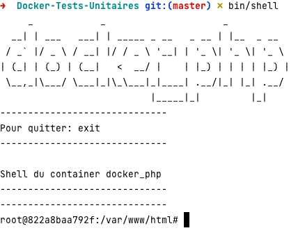

# Docker PHP et MySQL

Un environnement Docker pour le développement PHP

[toc]

# Configuration

Après avoir cloné ce dépôt, modifiez le fichier *docker-compose.yml* pour choisir la version de php souhaitée.

```yml
apache:
    build:
      context: .
      # PHP 7.4
      dockerfile: build/apache/php-7.4/Dockerfile
      # PHP 8.1
      #dockerfile: build/apache/php-8.1/Dockerfile
```

Modifiez le fichier **.env** pour l'adapter à vos besoins.
Vous y spécifiez le paramètre **SRC_DIR** qui pointe vers votre dossier contenant l'application.

# Lancement

Lancement du container nommé **docker_php** avec le fichier .env.

```bash
bin/start
```

# Affichage des logs

```bash
bin/log
```

# Lancement d'un shell

On va accéder au shell du container hébergeant l'application (ou vous pouvez le faire sur votre machine si elle dispose de phpunit).

```bash
bin/shell
```



Pour sortir, tapez **exit**

Installation des dépendances **composer**

```bash
composer install
```

Vous disposez désormais de **PhpUnit** accessible dans le dossier **vendor/bin**:

```bash
vendor/bin/phpunit tests
```